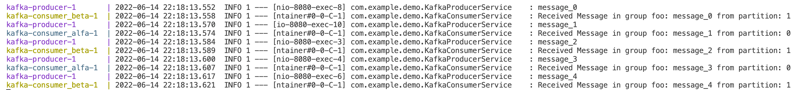
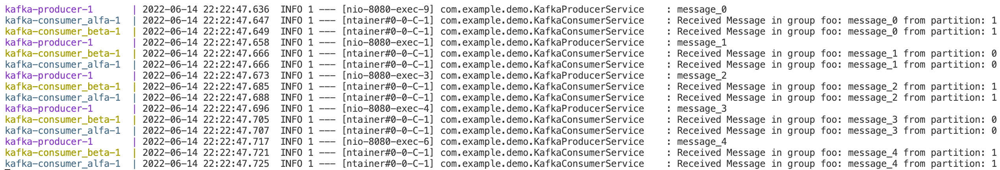

# Tutorial Kafka con Spring Boot

Include un `docker-compose.dev.yml` per avviare solo i servizi di supporto (zookeeper e kafka)

```bash
docker-compose -f docker-compose.dev.yml up
docker-compose -f docker-compose.dev.yml down
```

Include anche un `Dockerfile` per creare un'immagine docker contenente il jar dell'app spring boot (da creare com `mvn package -DskipTests`) e un `docker-compose.yml` per eseguire sia l'app che i servizi di supporto zookeeper e kafka.

```bash
mvn package -DskipTests
docker-compose build
docker-compose up
./test-producer.sh
...
docker-compose down
```

**Nota** Ad ogni modifica del codice java è necessario ricreare il jar (`mvn package`) e aggiornare l'immagine docker (`docker compose build`).

Il topic è configurato per avere 2 partizioni (vedi `KafkaTopicConfig.java`). 

Nel `docker-compose.yml` vengono creati due consumatori appartenenti allo stesso gruppo `foo`: ogni consumatore riceverà metà delle partizioni (una a testa) e quindi metà dei messaggi (round-robin). 

Se vogliamo che ogni consumatore riceva una copia di tutti i messaggi (broadcast) dobbiamo settare groupId diversi, es. `foo` e `bar`.

```yaml
producer:
    build: .
    restart: always
    ports:
      - 8080:8080
    depends_on:
      - kafka
    environment:
      SERVER_PORT: 8080
      KAFKA_BOOTSTRAPADDRESS: kafka:9092
      SPRING_PROFILES_ACTIVE: producer
      MESSAGE_TOPIC_NAME: spring-topic
  
  consumer_alfa:
    build: .
    restart: always
    depends_on:
      - kafka
    environment:
      KAFKA_BOOTSTRAPADDRESS: kafka:9092
      SPRING_PROFILES_ACTIVE: consumer
      MESSAGE_TOPIC_NAME: spring-topic
      GROUP_ID: foo
  
  consumer_beta:
    build: .
    restart: always
    depends_on:
      - kafka
    environment:
      KAFKA_BOOTSTRAPADDRESS: kafka:9092
      SPRING_PROFILES_ACTIVE: consumer
      MESSAGE_TOPIC_NAME: spring-topic
      GROUP_ID: foo
```

## consumer-alfa:foo & consumer-beta:foo



## consumer-alfa:foo & consumer-beta:bar



## Dispense

Vedi il contenuto della cartella `doc`.
