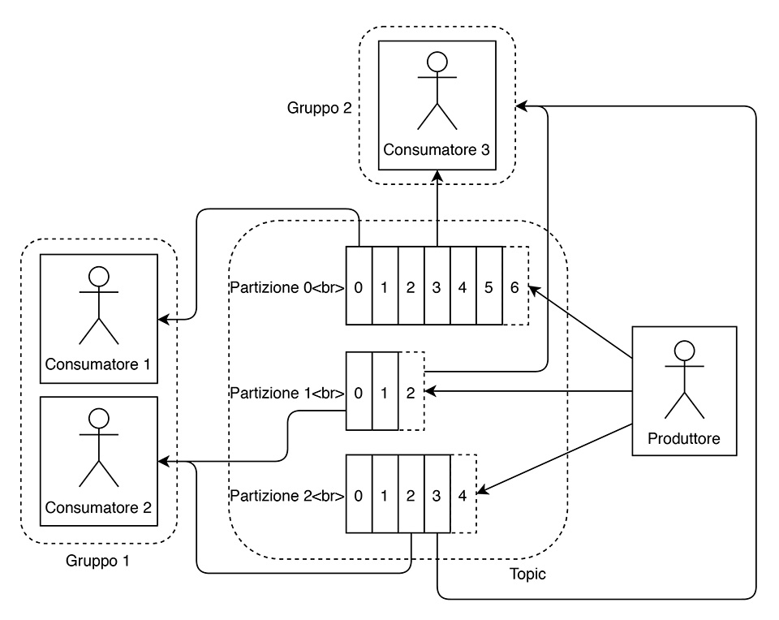
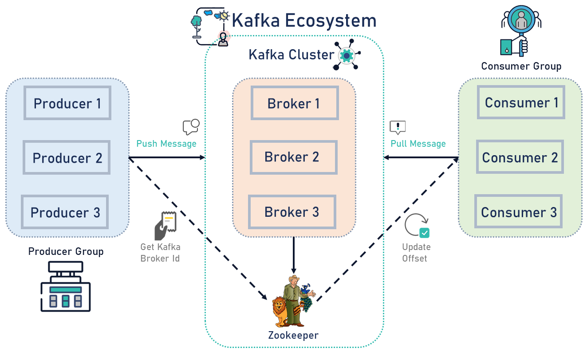

# Dispense su Kafka
#### *Andrea Fornaia*

## Apache Kafka

- Apache Kafka è una piattaforma di stream-processing distribuita scritta in Scala e in Java, inizialmente sviluppata da LinkedIn e divenuta open source a inizio 2011

- Si occupa di elaborare grandi moli di dati in tempo reale, permettendo di creare sistemi scalabili a elevato throughput e bassa latenza

- Gestisce anche la persistenza dei dati stessi sia sul server principale che sulle repliche, garantendo così fault-tolerance

- Diversi use case: message broker, stream processing, activity tracking, log aggregation 

## Funzionalità principali

- *messaging system*: gestione di stream di record in modalità **publish/subscribe**, similmente ad un message broker o ad altri enterpise messaging system.

- *storage system*: persistenza degli stream in maniera fault-tolerant.

- *stream processing*: elaborazione e trasformazione di stream in real time.

## Struttura di un Topic: Partitioned Log
Kafka fornisce un'astrazione di uno stream di record, chiamata *topic*.

Un topic è una categoria in cui i record vengono pubblicati. I topic in Kafka sono sempre *multi-subscriber*; ovvero, un topic può avere zero, uno, o molti consumatori iscritti, i quali verranno aggiornati quando nuovi record verranno aggiunti al topic.

Per ogni topic, un cluster Kafka mantiene un **log partizionato* come il seguente:

Ogni partizione è una sequenza ordinata e immutabile di record che viene continuamente estesa aggiungendo in coda (append) nuovi record.  

Ad ogni record in una partizione viene assegnato un id numerico seqeunziale chiamato *offset*, ed identifica univocamenteogni record all'interno della partizione.

Un cluster Kafka garantisce la persistenza dei record pubblicati anche quando questi sono già stati consumati, secondo un periodo di *retention* configurabile (es. 2 giorni). Ogni record sarà disponibile per nuovi consumatori fino allo scadere del tempo di retantion, dopo il quale il record verrà cancellato per liberare spazio.

## Concetti Principali

- **topic**: categoria utilizzata per raggruppare i messaggi; un topic è sempre **multi-subscriber**, ovvero può avere zero, uno o più consumatori.

- **partizione**: ciascuna delle sottosezioni in cui è diviso un topic;

- **record**: è il messaggio vero e proprio, costituito da una chiave, un valore e un timestamp;

- **offset**: indice progressivo che identifica univocamente un record all’interno di una partizione;

- **produttore**: entità che invia i messaggi a Kafka;

- **consumatore**: entità che riceve i messaggi da Kafka;

- **gruppo**: è un’etichetta utilizzata per distinguere insiemi di consumatori sottoscritti a un topic;

- **broker**: è un processo che si occupa di gestire la ricezione e la persistenza dei messaggi e i relativi offset;

- **cluster**: insieme di uno o più broker; avere più broker è utile per replicare e distribuire le partizioni;

- **replicazione**: ogni partitizionepuò essere replicata tra più broker per fault tolerance;

- **leader**: di una partizione replicata, il broker che ha il permesso di aggiungere record al topic;

- **follower**: di una partizione replicata, un broker che mantiene solo una copia dei record del topic; 

- **retantion**: i record (anche quelli consumati) vengono salvati per un periodo di retantion configurabile (es. 2 giorni). Un consumatore può richiedere quindi messaggi più vecchi.

## Produttori e Partizioni

La partizione a cui viene assegnato un messaggio viene determinata in tre modi:

- specificata dal produttore al momento dell’invio;
- determinata dall’hash della chiave del record, se presente;
- in round-robin se il produttore non ha indicato né una partizione né una chiave per il messaggio.

## Consumatori e Gruppi

I consumatori decidono a quale gruppo aderire, ed ogni record pubblicato nel topic verrà consegnato *ad un solo* consumatore all'interno del gruppo:

- Se tutti i consumatori fanno parte dello stesso gruppo si ottiene un **load balancing** dei record.

- Se tutti i consumatori fanno parte di gruppi diversi, si ottiene un **broadcast** dei record.

**Nota**: un consumatore non riceve mai automaticamente i messaggi, deve richiederli esplicitamente quando è pronto ad elaborarli.

## Partizioni e Gruppi

Le partizioni e i gruppi di consumatori sono gli elementi che permettono di scalare orizzontalmente un sistema.

Le partizioni di un topic vengono assegnate in maniera automatica, ottimizzata e trasparente ai consumatori. 

Quindi, tipicamente un consumatore **sceglie di iscriversi ad un topic, non ad una partizione**. Anche se in casi specifici, è possibile lasciare ai consumatori la scelta a quale partizione agganciarsi (ma è sconsigliato).

In particolare, detto C il numero di consumatori in un gruppo e P il numero di partizioni:

- se C < P le partizioni verranno distribuite in maniera uniforme tra i consumatori, assegnando più partizioni per consumatore;

- se C = P ciascun consumatore avrà una e una sola partizione;

- se C > P allora a P consumatori verrà assegnata una partizione, mentre C – P consumatori resteranno senza partizioni, e rimarranno in attesa che altri consumatori abbandonino la partizione (failover);

Il bilanciamento delle partizioni è dinamico, ossia esse vengono redistribuite al momento della connessione o disconnessione dei consumatori. 

**Nota:** anche se il numero di partizioni viene tipicamente scelto alla creazione del topic (di fatto influenzando in maniera diretta il livello di parallelismo possibile nel consumo dei record) questo può essere ridefinito successivamente, e Kafka si occuperà del ribilanciamento.

Ad esempio, è possibile **aumentare** il numero di partizioni su un topic esistente tramite la procedura di crazione di un topic: il nome del topic dovrà essere lo stesso di quello già esistente, mentre il numero di partizioni dovrà essere aumentato. Tutti i messaggi già depositati nelle partizioni esistenti rimarranno al loro posto. I nuovi messaggi invece verranno divisi tenendo conto delle nuove partizioni.

## Apache ZooKeeper

- ZooKeeper è un servizio di coordinamento centralizzato di sistemi distribuiti

- Espone primitive per risolvere problemi comuni di sincronizzazione (es. randez-vous, leader election) e di condivisione di configurazioni (es. metadati).

- Sviluppare queste funzionalità per un’applicazione distribuita può essere complesso (race-condition, dead lock)

- Kafka utilizza ZooKeeper per il coordinamento dei nodi all’interno dei cluster (metadati, appartenenza al cluster, controller election, stato configurazione topic, ACL)

- Per usare Kafka è necessario avviare un’istanza di ZooKeeper, anche avendo un singolo nodo.

# Riferimenti

- [J. Kreps et al.: *Kafka: a Distributed Messaging System for Log Processing*](https://www.microsoft.com/en-us/research/wp-content/uploads/2017/09/Kafka.pdf)
- [http://kafka.apache.org/20/documentation/]()
- [https://www.cloudkarafka.com/blog/2018-07-04-cloudkarafka\_what\_is\_zookeeper.html]()
- [http://kafka.apache.org/intro]()
- [https://kafka.apache.org/quickstart]()
- [http://www.mokabyte.it/2018/10/microservizikafka/]()
- [https://medium.com/better-programming/kafka-docker-run-multiple-kafka-brokers-and-zookeeper-services-in-docker-3ab287056fd5]()
- [http://wurstmeister.github.io/kafka-docker/]()
- [https://www.baeldung.com/spring-kafka]()
- [https://docs.spring.io/spring-kafka/reference/html/]()
- [https://stackoverflow.com/questions/48245398/spring-boot-containers-can-not-connect-to-the-kafka-container]()
